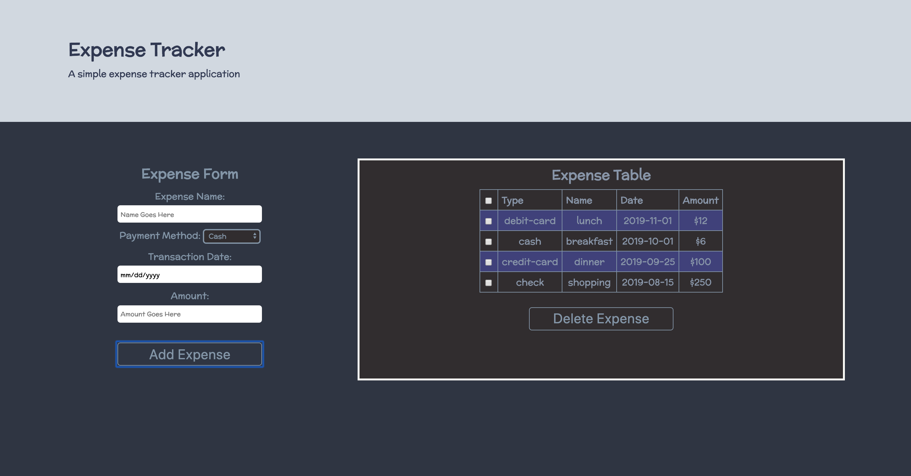

# Expense Tracker

Checkout the project [HERE](https://polar-sands-39515.herokuapp.com/)

 

 
 

***

## Description:

This project is developed from scratch using **React** and **JavaScript**.  This is a simple expense tracker application.  The project is deployed using **Heroku** and styled using the **CSS Grid** system.  This project is hosted on **Github** using **Git** as version control system.

#### In this application, the user is able to:
* Each expense includes:
    * _date_
    * _description_
    * _amount_
    * _transaction type_
* Add expense(s) to table
* Delete expense(s) from table
* LocalStorage is used to persist the returned data

***