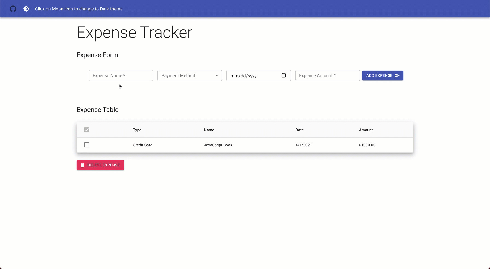

# Expense Tracker

Checkout the project [HERE](https://polar-sands-39515.herokuapp.com/)

## Description:

This project is developed from scratch using **React** and **JavaScript**. This is a simple expense tracker application. The project is deployed using **Heroku** and styled using **Material UI**. This project is hosted on **Github** using **Git** as version control system.

#### In this application, the user is able to:

- Each expense includes:
  - _date_
  - _description_
  - _amount_
  - _transaction type_
- Add expense(s) to table
- Delete expense(s) from table
- LocalStorage is used to persist the returned data

---

### Author

- Ahmed Abdelaal - [Website](https://aa-dev.io/) | [LinkedIn](https://www.linkedin.com/in/aa-dev/)

Test
